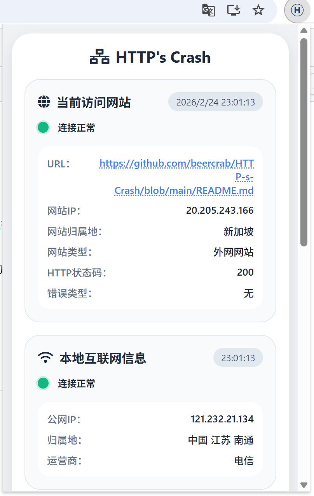

  

## 网络诊断助手 （HTTP's Crash）

一个功能强大的 Chrome 扩展，用于快速诊断网络连接问题、查看网站详细信息、记录网络请求日志，并提供用户自查建议。与传统的 OSI/TCP/IP 模型自底向上分析不同，本工具采用自上而下的 HTTP 应用层诊断方法，直接聚焦于用户最关心的网站访问问题，屏蔽底层复杂网络细节，让故障排查更简单、更快速。

## 功能特性✨

- **当前网站诊断**：自动检测当前标签页的网站连接状态，显示：
  - 网站 IP 地址
  - 网站归属地（国家/地区 + 省市）
  - 网站类型（内网/外网）
  - HTTP 状态码
  - 错误类型（超时、网络错误等）
- **本地互联网信息**：获取本地公网 IP、归属地及运营商信息，并显示连接状态灯。
- **用户自查建议**：根据诊断结果提供针对性的排查步骤（如检查运营商线路、路由器、代理、网线等）。
- **手动检测**：支持输入任意 URL 进行测试，快速判断是否为单一网站问题。
- **上网审计**：记录所有 HTTP/HTTPS 请求日志（类型、方法、URL、状态码、IP、错误），可保存为文本文件。
- **自动显示弹窗**：当主框架请求失败时，自动弹出扩展窗口（可手动开关）。
- **快速操作**：一键刷新页面、清除浏览器缓存、打开上网审计页面。
- **复制诊断结果**：一键复制当前诊断报告，便于反馈给技术支持。

## 界面预览🔍

| 主界面 |手动检测 |
|:------:|:--------:|
|  |  |

| 快速操作 | 上网审计 |
|:------:|:--------:|
|  |  |

## 安装方法📲

1. 下载本仓库源码并解压。
2. 打开 Chrome 浏览器，进入 `chrome://extensions/`。
3. 开启右上角的“开发者模式”。
4. 点击“加载已解压的扩展程序”，选择解压后的文件夹。
5. 扩展图标将出现在浏览器工具栏中。

## 使用方法🔔

1. 点击工具栏中的扩展图标，打开主界面。
2. **当前访问网站**卡片自动显示诊断结果。若显示“未知”，请刷新页面或点击扩展重新检测。
3. **本地互联网信息**卡片显示公网 IP 及连接状态。
4. 根据**用户自查建议**进行排查。
5. 如需测试其他网站，在**手动检测**栏输入 URL 并点击“检测”。
6. 点击“上网审计”快速操作可查看所有请求日志，并支持保存到本地。
7. 点击“自动显示”开关可控制是否在网站访问失败时自动弹出扩展。

## 开发背景👨‍💻

本项目由一位企业系统运维人员发起，作者并非专业开发者，但借助 **AI 辅助编程（DeepSeek V3.2）** 和自然语言设计需求，完成了第一个 Chrome 扩展的开发。初衷是为网络管理人员和普通用户提供一种 **更直观、更高效的网络故障排查方式**。传统的网络排查基于 OSI 或 TCP/IP 模型自底向上分析，往往需要深厚的网络知识且耗时较长。而本工具采用**自上而下的方法**，直接从用户能感知的 HTTP 应用层入手，快速定位问题根源，屏蔽底层复杂细节，让任何人（无论技术背景）都能轻松上手。

## 技术栈🛠️

- **Manifest V3** - Chrome 扩展最新规范
- **原生 JavaScript** - 无任何第三方依赖
- **Chrome Extensions API** - `webRequest`, `tabs`, `dns`, `storage`, `notifications` 等
- **Font Awesome** - 图标库（界面美化）
- **cip.cc / ip-api.com** - IP 归属地查询 API（备用）

## 许可证📄

本项目采用 MIT 许可证。详见 [LICENSE](LICENSE) 文件。

## 作者👦

- [Bian ChenYang](https://github.com/beercrab) - 初始开发

## 致谢😊

- 感谢 [cip.cc](http://cip.cc) 和 [ip-api.com](http://ip-api.com) 提供免费的 IP 归属地查询服务。
- 感谢 DeepSeek AI 提供的智能辅助，使无开发经验的作者也能完成此项目。
- 所有贡献者和用户的支持。

---

**注意⚠️**：本扩展仅用于网络诊断辅助，不收集任何用户隐私数据。所有请求日志仅保存在本地，不会上传至任何服务器。

---

支持浏览器：Google Chrome 和 Microsoft Edge（基于 Chromium）。
